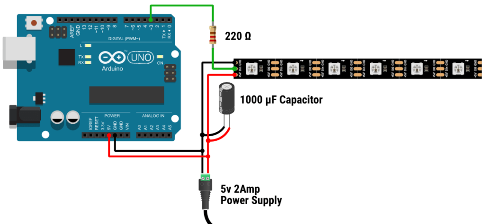
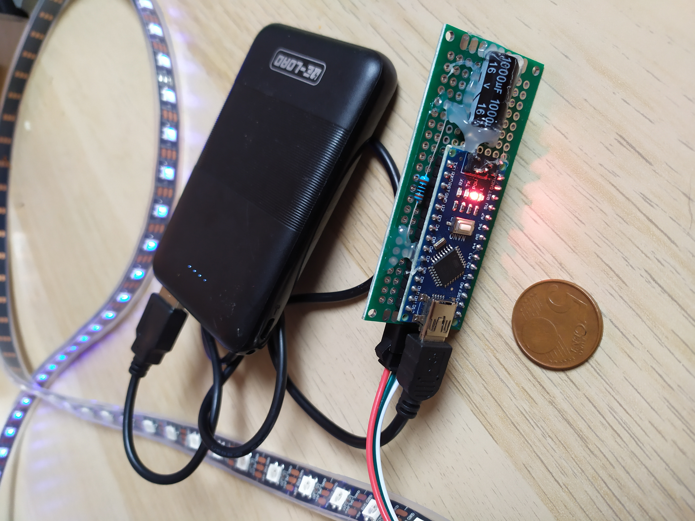

# Arduino, ws2812b addressable ledstrip & FastLED Library

An elegant and streamlined script designed for managing a WS2812B addressable LED strip using an embedded Arduino Nano, powered by a standard USB power bank.

* [https://arduino.cc/](https://www.arduino.cc/)

* [Adafruit's ws2812b datasheet](https://cdn-shop.adafruit.com/datasheets/WS2812B.pdf)

* [FastLED Animation Library](https://fastled.io/)



## Videos

https://github.com/yzpt/ws2812b/assets/140260395/834fdeff-d45a-46db-ba1b-3e91130749b2

https://github.com/yzpt/ws2812b/assets/140260395/b6e15f6f-4918-4eff-af4d-01844f1e58d0

## Compact Embedded Circuit Overview



## Code

```c++
#include <FastLED.h>
#define LED_TYPE WS2812B
#define NUM_LEDS 100
#define DATA_PIN 6
#define BRIGHTNESS 180
#define maxValue 159
CRGB leds[NUM_LEDS];

// nombre d'objets gaussiens max 
// pour une strip de 100 leds, nous
// sommes à la limite de la mémoire
// dynamqiue de l'arduino 
// avec 6 objets gaussiens
int nombreObjets = 6;
int indexObjets = 0;

// attirbuts des pseudo-objets gaussiens
int objet_hue[6];
int objet_sat[6];
int objet_valeurs[6][106];
int objet_centre[6];
int objet_spread[6];
int objet_interval[6];
int objet_sens[6];
int objet_enveloppe_centre[6];
unsigned long objet_enveloppe_spread[6];
unsigned long objet_prevRefresh[6];
unsigned long objet_prevCreate[6];

// composition d'une palette de couleurs voulue pour certains thèmes
// ici rouge(0) et bleu(160)
int palette_RB[] = {0, 160};
int palette_centres[] = {0, NUM_LEDS/2,  NUM_LEDS - 1};
int index_palette_RB = 0;

// durée un loop complet (3min30)
int moduloLoopProg = 210;

float gauss(float centre, float spread, float x) {
  return round( maxValue * exp( -(x - centre) * (x - centre) / (spread)) );
}

float enveloppeGauss(float centre, float spread, float x) {
  return exp( -(x - centre) * (x - centre) / (spread));
}

void addLedHSV(int ledPosition, int hue, int saturation, int value) {
  leds[ledPosition] += CHSV(hue, saturation, value);
}

void setLedHSV(int ledPosition, int hue, int saturation, int value) {
  leds[ledPosition] = CHSV(hue, saturation, value);
}


void calculerTableauValeurs (float centre, float spread, int indexTableau) {
  for (int i = 0; i < NUM_LEDS; i++) {
    int temp = centre;
    objet_valeurs[indexTableau][i] = gauss(centre, spread, (i + temp) % NUM_LEDS);
  }
}

void creerObjet(int hue, int sat, int centre, int spread, int interval, int sens, int enveloppe_centre, unsigned long enveloppe_spread) {
  objet_hue[indexObjets] = hue;
  objet_sat[indexObjets] = sat;
  objet_centre[indexObjets] = centre;
  objet_spread[indexObjets] = spread;
  objet_interval[indexObjets] = interval;
  objet_sens[indexObjets] = sens;
  objet_prevCreate[indexObjets] = millis();
  objet_enveloppe_centre[indexObjets] = enveloppe_centre;
  objet_enveloppe_spread[indexObjets] = enveloppe_spread;

  calculerTableauValeurs(centre, spread, indexObjets);
  indexObjets = (indexObjets + 1) % nombreObjets;
}

void shiftTableau(int indexObjets) {
  if (millis() - objet_prevRefresh[indexObjets] > objet_interval[indexObjets]) {
    objet_prevRefresh[indexObjets] = millis();
    if (objet_sens[indexObjets] == 1) {
      int temp = objet_valeurs[indexObjets][0];
      for (int i = 0; i < (NUM_LEDS - 1); i++) {
        objet_valeurs[indexObjets][i] = objet_valeurs[indexObjets][(i + 1)];
      }
      objet_valeurs[indexObjets][NUM_LEDS - 1] = temp;
    } else {
      int temp = objet_valeurs[indexObjets][NUM_LEDS - 1];
      for (int i = (NUM_LEDS - 1); i > 0; i--) {
        objet_valeurs[indexObjets][i] = objet_valeurs[indexObjets][(i - 1)];
      }
      objet_valeurs[indexObjets][0] = temp;
    }
  }
}

void setObjet(int indexObjets) {
  float tempEnv = enveloppeGauss(objet_enveloppe_centre[indexObjets], objet_enveloppe_spread[indexObjets], millis() - objet_prevCreate[indexObjets]);
  for (int i = 0; i < NUM_LEDS; i++) {
    leds[i] += CHSV(objet_hue[indexObjets], objet_sat[indexObjets], objet_valeurs[indexObjets][i] * tempEnv);
  }
}

void clr() {
  for (int i = 0; i < NUM_LEDS; i++) {
    leds[i] = CRGB::Black;
  }
}

void afficherObjets() {
  clr();
  for (int i = 0; i < nombreObjets; i++) {
    shiftTableau(i);
    setObjet(i);
  }
}

void setup() {
  FastLED.addLeds<NEOPIXEL, DATA_PIN>(leds, NUM_LEDS).setCorrection(TypicalLEDStrip);
  FastLED.setBrightness(BRIGHTNESS);
}

void loop() {

// génération aléatoire d'objets gaussiens
// ici selon 4 thèmes en boucle
  if (random16() < 375) {
    if (bseconds16()%180 < 30) {
      creerObjet(   160,                            // hue
                    255,                            // sat
                    NUM_LEDS/2,                     // centreGauss
                    random(50, 1500),               // spreadGauss
                    random(2, 20),                  // interval
                    random(2),                      // sens
                    random(3000, 6000),             // enveloppe gauss centre
                    random(1000000, 5000000)        // enveloppe gauss spread
                );
      
    } else if (bseconds16()%180 < 90) {
      creerObjet(   palette_RB[index_palette_RB],   // hue
                    255,                            // sat
                    NUM_LEDS/2,                     // centreGauss
                    random(50, 1500),               // spreadGauss
                    random(2, 20),                  // interval
                    random(2),                      // sens
                    random(3000, 6000),             // enveloppe gauss centre
                    random(1000000, 5000000)        // enveloppe gauss spread
                );
      index_palette_RB = (index_palette_RB + 1) % 2;
    } else if (bseconds16()%180 < 120){
      creerObjet(   random(224,287)%255,            // hue
                    255,                            // sat
                    NUM_LEDS/2,                     // centreGauss
                    random(50, 1500),               // spreadGauss
                    random(2, 40),                  // interval
                    random(2),                      // sens
                    random(3000, 6000),             // enveloppe gauss centre
                    random(1000000, 5000000)        // enveloppe gauss spread
                );
    } else if (bseconds16()%180 < 180){
      creerObjet(   random(255),                    // hue
                    255,                            // sat
                    NUM_LEDS/2,                     // centreGauss
                    random(50, 1500),               // spreadGauss
                    random(2, 40),                  // interval
                    random(2),                      // sens
                    random(3000, 6000),             // enveloppe gauss centre
                    random(1000000, 5000000)        // enveloppe gauss spread
                );
    } 
  }
  
  afficherObjets();
  FastLED.show();
}
```

## ws2812b + Teensy 3.2 + Ableton via Midi Serial US Bus

I've started an implementation with Ableton via a Teensy 3.2

https://github.com/yzpt/ws2812b/assets/140260395/b212ffa1-313d-4ec8-b21d-aad0c8c4dcfd


